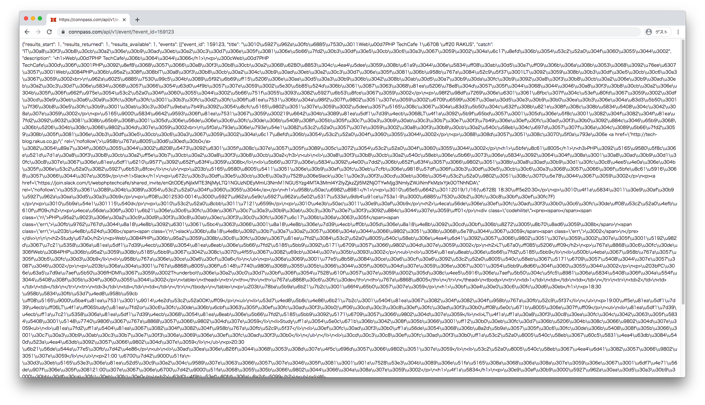
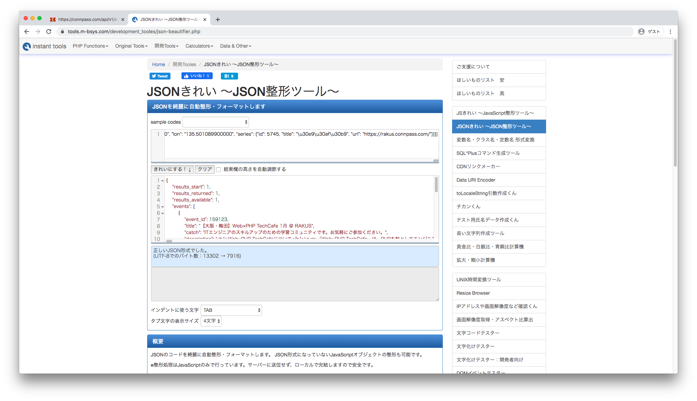
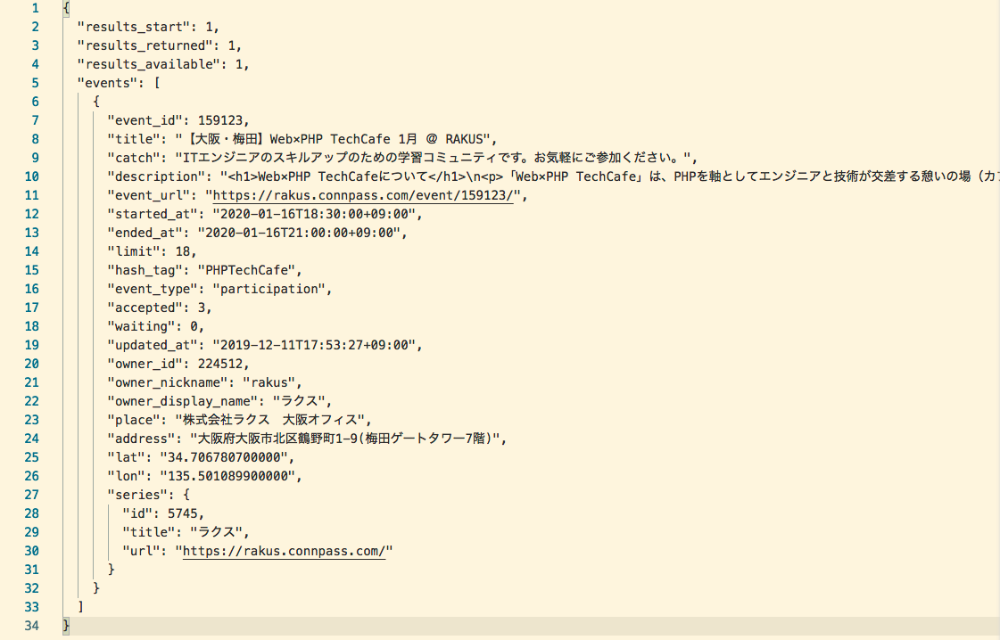

## はじめに

この記事は [Web × PHP TechCafe Advent Calendar 2019](https://qiita.com/advent-calendar/2019/php-tech-cafe) の12/21の記事です。

こんにちは、Yumihikiです。本日はWeb APIについての記事を書くことにしました！

初心者の観点から、そもそもWeb APIについてまとめた記事になりますので、本格的なものではありませんがご容赦ください。

## Web APIとは

まず、APIとはアプリケーションプログラミングインターフェース(Application Programming Interface)の略称です。
Web APIはHTTP通信を利用して行うAPIのことで、各種Webサービスで出来る機能をWebを通じて外部から呼び出せるようにしたもの、、、と言った意味合いになります。

概念だけだといまいちピンと来ないですよね。APIの例として良く挙げられているのがTwitter APIです。Twitter APIを利用することで例えばTwitter以外のサービスでも、実際にTwitterを利用して行う動作、例えば投稿やフォローなどの基本的な機能から、ツイートの自動化やフォローしているユーザーの情報を取得するなんてことを実現可能にします。

## APIを公開する利点

さて、アプリケーションを公開する側としてはどのような利点があるのでしょうか。調べたところによると、公開することでさまざまな付加価値を他の企業や個人が提供してくれるようになり、サービスの価値や情報の質が上る可能性も十分にあるそうです。（Web API:The Good Parts　初版第８刷　水野 貴明著 P13より引用）

例えば個人開発でAPIを提供した場合を例に挙げてみると、時間的な制約から自分が開発したくても開発できない機能があった場合、APIを提供することで誰かが開発をしてくれる可能性があります。

また反対に自身が利用者の立場だった時に「こういう機能が欲しいな」と思った時、APIを活用することでその機能を実現させることができるかもしれません。
このように、APIを公開することで利用者（開発者）と提供する側どちらにもメリットがあるようです。

## APIってどんなものがあるのか

色々なWebサービスがAPIを提供しています。

- Twitter
- GitHub
- Qiita
- connpass

などなど... 利用するWebサービスの多くはAPIを提供しているみたいです。登録をしないと利用できないものもあれば、登録せずに利用できるものもあります。

そして、APIはJSONという形式で返されることが多いです。歴史的な流れで言うと、以前はXML形式で返されることが主流だったそうなのですが、今現在はJSONが主流になっているそうです。

## APIの例

では、connpassのイベントサーチAPIを例に挙げてどんな感じなのかみてみましょう。Web APIはHTTP通信を利用しているため、ブラウザ上で確認することができます。

[connpass API リファレンス](https://connpass.com/about/api/)にconnpassのイベントサーチAPIについてまとめられています。
今回は例として、Web×PHP TechCafe 1月のイベント情報を取得してみましょう。

connpassのイベント情報ページのURLは`https://rakus.connpass.com/event/159123/`のようになっており、最後から2つ目のスラッシュから始まる数字である159123がイベント情報ページのIDを表しています。
検索クエリのパラメータでいうところの、event_idにあたります。

このevent_idを用いて検索してみるには

`https://connpass.com/api/v1/event/?event_id=159123`というURLにアクセスしてみることで検索することができます。実際にアクセスしてみましょう。

ブワァーっとJSONが返されます。全くわけがわかりません。断片的に情報がありそうな感じがしますが、読めませんよね。人間が読みやすい形になっていないので整形してみましょう。

これらをコピペして、
[JSON綺麗　〜JSON整形ツール〜](https://tools.m-bsys.com/development_tooles/json-beautifier.php)
というツールで整形してみることにします。インストールなど不要なので今回利用させてもらいました。

そしてエディタに貼り付けてみます。

このような感じになり、このような情報が実際に返されている事がわかりました！！

このようにAPIを利用して情報を取得できるため、上述したような「こんな機能が欲しいけど無いから作ろうか」と言った場合にとても便利なことがわかりました。

APIがわからない、どんなものなの？　という方の助けになれば幸いです。

## 最後にまとめ

実はこの記事を書いた動機はいくつかありまして、列挙すると

- そもそもAPIっていうけど何なのか漠然としか知っていなかった
- LaravelでAPIを作るっていう人が居たけど、どういうことかわからなかった（個人で簡単に作れるの？）
- 内定先の面接時に足りない知識について尋ねたところAPIについて挙げられた

といった理由になります。
APIを作るまではこの記事で解説はしていませんが、[SAWさんのアドベントカレンダー記事](https://sierra-kilo.hatenablog.jp/entry/2019/12/15/070000)が参考になるかと思います。

BFF(Backends For Frontends)という技術もあるそうなので、APIを活用していくことがこれからのエンジニアに求められるんだなぁと思っています。

今まで漠然とした知識しかありませんでしたが、今回[Web API: The Good Parts](https://www.oreilly.co.jp/books/9784873116860/)という書籍も購入し、読んでみてAPIがどういうものなのか体系的に学習できて良い経験になりました！

これからも積極的に技術を学習していきたいと思います。

最後まで読んでくださりありがとうございました。
